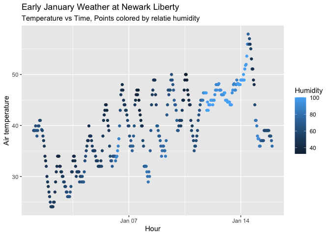

P8105 HW1
================
Veerapetch Petchger
2025-09-11

## Problem 1

##### Load the moderndive library, and use the following code to load the `early_january_weather` dataset:

``` r
early_january_weather
```

    ## # A tibble: 358 × 15
    ##    origin  year month   day  hour  temp  dewp humid wind_dir wind_speed
    ##    <chr>  <int> <int> <int> <int> <dbl> <dbl> <dbl>    <dbl>      <dbl>
    ##  1 EWR     2013     1     1     1  39.0  26.1  59.4      270      10.4 
    ##  2 EWR     2013     1     1     2  39.0  27.0  61.6      250       8.06
    ##  3 EWR     2013     1     1     3  39.0  28.0  64.4      240      11.5 
    ##  4 EWR     2013     1     1     4  39.9  28.0  62.2      250      12.7 
    ##  5 EWR     2013     1     1     5  39.0  28.0  64.4      260      12.7 
    ##  6 EWR     2013     1     1     6  37.9  28.0  67.2      240      11.5 
    ##  7 EWR     2013     1     1     7  39.0  28.0  64.4      240      15.0 
    ##  8 EWR     2013     1     1     8  39.9  28.0  62.2      250      10.4 
    ##  9 EWR     2013     1     1     9  39.9  28.0  62.2      260      15.0 
    ## 10 EWR     2013     1     1    10  41    28.0  59.6      260      13.8 
    ## # ℹ 348 more rows
    ## # ℹ 5 more variables: wind_gust <dbl>, precip <dbl>, pressure <dbl>,
    ## #   visib <dbl>, time_hour <dttm>

##### Write a short description of the dataset using inline R code; accessing the dataset help file can be informative. In your discussion, please include, the variables in this dataset, including names / values of important variables, the size of the dataset (using nrow and ncol), and the mean temperature

This dataset has 358 rows and 15 columns. It covers the hourly
temperature measurements at Newark Liberty (EWR) International airport
on from January 1 to 15. Important variables in this dataset include
`temp` (temperature), `dewp` (dew point), `humid` (relative humidity),
`wind_dir` (wind direction), `wind_speed`, `wind_gust`, `precip`
(rainfall), `pressure`, and `visib` (visibility). The mean temperature
over this period is 39.5821229 °F.

##### Make a scatterplot of temp (y) vs time_hour (x); color points using the humid variable (adding color = … inside of aes in your ggplot code should help). Describe patterns that are apparent in this plot.

``` r
ggplot(early_january_weather, aes(x = time_hour, y = temp, color = humid)) +
  geom_point() +
  labs(
    title = "Early January Weather at Newark Liberty",
    subtitle = "Temperature vs Time, Points colored by relatie humidity",
    x = "Hour",
    y = "Air temperature",
    color = "Humidity",
  )
```

<!-- --> The
temperatures generally rise during the daytime and decline overnight.
Humidity appears to have an inverse relationship with weather, recording
its highest values during the night. Over the span of days, as the daily
temperatures slightly increase, humidity also tends to be higher.

##### Export your scatterplot to your project directory using ggsave.

``` r
ggsave("early_jan_weather_scatterplot.pdf")
```

    ## Saving 7 x 5 in image

## Problem 2

##### This problem is intended to emphasize variable types and introduce coercion; some awareness of how R treats numeric, character, and factor variables is necessary for working with these data types in practice. Create a data frame comprised of a random sample of size 10 from a standard Normal distribution, a logical vector indicating whether elements of the sample are greater than 0, a character vector of length 10, and a factor vector of length 10, with 3 different factor “levels”

``` r
set.seed(1)
problem_2_df =
  tibble(
  normal = rnorm(10),
  log_vec = normal > 0,
  char = sample(letters, 10),
  factor_3 = factor(
    sample(c("Low","Med","High"), 10, replace = TRUE),
    levels = c("Low","Med","High")
  )
)
problem_2_df
```

    ## # A tibble: 10 × 4
    ##    normal log_vec char  factor_3
    ##     <dbl> <lgl>   <chr> <fct>   
    ##  1 -0.626 FALSE   i     Med     
    ##  2  0.184 TRUE    o     Low     
    ##  3 -0.836 FALSE   u     High    
    ##  4  1.60  TRUE    e     Low     
    ##  5  0.330 TRUE    z     High    
    ##  6 -0.820 FALSE   n     Med     
    ##  7  0.487 TRUE    w     Med     
    ##  8  0.738 TRUE    t     Med     
    ##  9  0.576 TRUE    b     Med     
    ## 10 -0.305 FALSE   j     High

##### Try to take the mean of each variable in your dataframe. What works and what doesn’t?

##### Hint: for now, to take the mean of a variable in a dataframe, you need to pull the variable out of the dataframe. Try loading the tidyverse and using the pull function.

``` r
problem_2_df %>%
  pull(normal) %>%
  mean()
```

    ## [1] 0.1322028

``` r
problem_2_df %>%
  pull(log_vec) %>%
  mean()
```

    ## [1] 0.6

``` r
problem_2_df %>%
  pull(char) %>%
  mean()
```

    ## Warning in mean.default(.): argument is not numeric or logical: returning NA

    ## [1] NA

``` r
problem_2_df %>%
  pull(factor_3) %>%
  mean()
```

    ## Warning in mean.default(.): argument is not numeric or logical: returning NA

    ## [1] NA

Using the `pull` function, the mean of the standard normal distribution
and logical vector can be obtained. However, the character and factor
vectors do not return a mean.

##### In some cases, you can explicitly convert variables from one type to another. Write a code chunk that applies the `as.numeric` function to the logical, character, and factor variables (please show this chunk but not the output). What happens, and why? Does this help explain what happens when you try to take the mean?

``` r
problem_2_df %>%
  pull(log_vec) %>%
  as.numeric() %>%
  mean()

problem_2_df %>%
  pull(char) %>%
  as.numeric() %>%
  mean()

problem_2_df %>%
  pull(factor_3) %>%
  as.numeric() %>%
  mean()
```

When applying the `as.numeric` function, the logical vector has its
values changed such that `TRUE` becomes `1`, and `FALSE` becomes `0`.
Therefore, the mean of this vector is attributable to the proportion of
`TRUEs` in the data. The character vector still does not yield a mean.
However, if the strings are similar to numbers, they will be interpreted
and converted into numbers, yielding a mean. In this specific example,
the character vector samples from the letters from the alphabet. The
factor vector returns the internal integer codes. That is, `Low`, `Med`,
and `High`, are converted into `1`, `2`, and `3`, respectively. The mean
is taken from those numbers.
